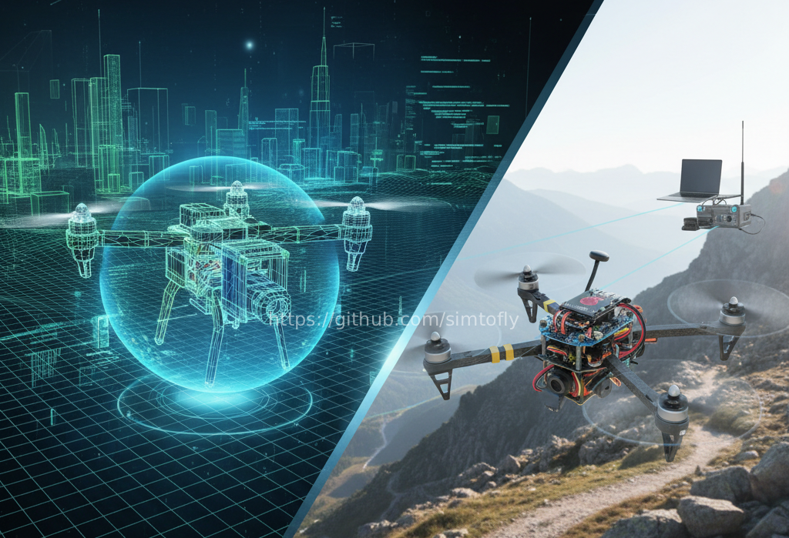

# SimToFly — Drone Autonomy Guide



<p align="center">
  <b>From Simulation to Flight</b><br>
 Complete beginner-friendly tutorials for autonomous drones using ROS2 Humble, ArduPilot, and Gazebo Harmonic
</p>

<p align="center">
  <a href="https://simtofly.github.io/simtofly-guide/">Documentation</a> •
  <a href="#getting-started">Getting Started</a> •
  <a href="#tutorial-phases">Tutorial Phases</a> •
  <a href="#community">Community</a>
</p>

<p align="center">
  
  
  
  <a href="https://github.com/simtofly/simtofly-guide/stargazers"></a>
  <a href="https://github.com/simtofly/simtofly-guide/blob/main/LICENSE"></a>
  <a href="https://simtofly.github.io/simtofly-guide/"></a>
</p>

---

## Overview

Learn autonomous drone development from simulation to real hardware deployment using modern tools: ROS2, ArduPilot SITL, and Gazebo Harmonic.

**Who this is for:**
- Beginners with no prior ROS or ArduPilot experience
- Developers wanting to learn modern drone autonomy stack
- Students and hobbyists building autonomous drones
- Anyone interested in transitioning from simulation to real hardware

**What you'll build:**
- Complete SITL simulation environment
- 3D visualization with Gazebo Harmonic
- ROS2 integration with MAVROS
- Companion computer deployment on Raspberry Pi
- Real autonomous flight system

---

## Documentation

**[Visit Documentation Website](https://simtofly.github.io/simtofly-guide/)**

Professional documentation with search, dark mode, mobile support, and video tutorials.

---

## Tutorial Phases

### Phase 1: Simulation Mastery ✅

Master drone fundamentals in safe virtual environment.

**Topics:**
- Prerequisites and environment setup
- ArduPilot SITL installation
- MAVProxy command-line control
- Gazebo Harmonic 3D simulation
- First autonomous waypoint mission

**Status:** Complete  
**Time:** 6-8 hours  
**Start:** [Phase 1 Documentation](docs/phase-1-simulation/README.md)

---

### Phase 2: ROS2 Integration

Connect ArduPilot to Robot Operating System.

**Topics:**
- ROS2 Humble installation
- MAVROS setup and configuration
- Understanding topics and services
- Custom ROS2 control nodes
- Autonomous missions via ROS2

**Status:** In Development  
**Expected:** February 2026

---

### Phase 3: Companion Computer

Deploy ROS2 on Raspberry Pi for onboard processing.

**Topics:**
- Raspberry Pi configuration
- Serial connection to flight controller
- ROS2 node deployment
- Hardware-in-the-loop testing
- Network communication

**Status:** Planned  
**Expected:** March 2026

---

### Phase 4: Real Hardware

Deploy complete system on actual drone.

**Topics:**
- Hardware assembly and wiring
- Pre-flight safety procedures
- Ground testing
- First real flight test
- Complete mission deployment

**Status:** Planned  
**Expected:** April 2026

---

## Getting Started

### Prerequisites

**Hardware:**
- Computer with 8GB RAM minimum (16GB recommended)
- Ubuntu 22.04 LTS (native or VM)
- 30GB free disk space
- Stable internet connection

**Knowledge:**
- Basic terminal/command-line familiarity
- No prior ROS or ArduPilot experience required

### Quick Start

1. **Check system requirements:** [Prerequisites Guide](docs/phase-1-simulation/1.1-prerequisites.md)
2. **Set up environment:** [Environment Setup](docs/phase-1-simulation/1.2-environment-setup.md)
3. **Start learning:** [Phase 1 Overview](docs/phase-1-simulation/README.md)

**👉 [Begin Phase 1: Simulation Mastery](docs/phase-1-simulation/README.md)**

---

## Verified System

All tutorials tested and verified on:

**Software Stack:**
- Ubuntu 22.04 LTS
- ArduPilot Copter 4.5.7
- ROS2 Humble
- Gazebo Harmonic
- MAVProxy 1.8+

**Hardware (Phase 4):**
- Flight Controller: Cube Orange / Pixhawk 6X
- Companion Computer: Raspberry Pi 4 (4GB+)
- Frame: Various quadcopter frames tested

**Last verified:** December 2025

---

## Repository Structure

```
simtofly-guide/
├── docs/
│   ├── phase-1-simulation/      # SITL and Gazebo tutorials
│   ├── phase-2-ros2/            # ROS2 integration guides
│   ├── phase-3-companion/       # Raspberry Pi setup
│   ├── phase-4-hardware/        # Real drone deployment
│   ├── appendix/                # Ubuntu install, terminal setup
│   └── images/                  # Logos and shared assets
├── mkdocs.yml                   # Documentation configuration
└── README.md                    # This file
```

---

## Community

### Get Help

- **Questions:** [GitHub Discussions](https://github.com/simtofly/simtofly-guide/discussions)
- **Bug Reports:** [GitHub Issues](https://github.com/simtofly/simtofly-guide/issues)
- **Documentation:** [Website](https://simtofly.github.io/simtofly-guide/)

### Contribute

We welcome contributions! Ways to help:
- Report bugs or errors in tutorials
- Suggest improvements or new topics
- Submit fixes via pull requests
- Share your success stories
- Help other learners in discussions

See [CONTRIBUTING.md](CONTRIBUTING.md) for guidelines.

### Stay Updated

- ⭐ Star this repository for updates
- Watch for new releases
- Follow [@sidharthmohannair](https://github.com/sidharthmohannair)

---

## Related Repositories

**SimToFly Ecosystem:**
- [simtofly-ros2](https://github.com/simtofly/simtofly-ros2) — ROS2 packages and examples *(coming soon)*
- [simtofly-setup](https://github.com/simtofly/simtofly-setup) — Automated setup scripts *(coming soon)*

---

## License

This project is licensed under the MIT License - see the [LICENSE](LICENSE) file for details.

### Permissions

- Commercial use
- Modification
- Distribution
- Private use

### Conditions

- License and copyright notice must be included

### Limitations

- No Liability
- No Warranty

**Note:** While attribution is not legally required, it is appreciated and helps the project grow.

---

## Acknowledgments

Built with knowledge from:
- [ArduPilot](https://ardupilot.org/) community and documentation
- [ROS2](https://docs.ros.org/) official guides
- [MAVROS](https://github.com/mavlink/mavros) maintainers
- Open-source drone community

Special thanks to everyone who contributes to open-source robotics and drone software.

---

## About

**Author:** [Sidharth Mohan Nair](https://github.com/sidharthmohannair)

**Project Goals:**
- Make drone autonomy accessible to beginners
- Provide complete workflow from simulation to hardware
- Use modern tools (ROS2, latest ArduPilot)
- Verify all tutorials on real hardware
- Maintain active documentation


---

<p align="center">
  <b>Ready to start your journey?</b><br>
  <a href="docs/phase-1-simulation/README.md"> Begin Phase 1: Simulation Mastery</a>
</p>

<p align="center">
  Made with ❤️ for the drone community<br>
  <a href="https://github.com/simtofly">SimToFly</a> • 
  <a href="https://github.com/sidharthmohannair">@sidharthmohannair</a>
</p>

---