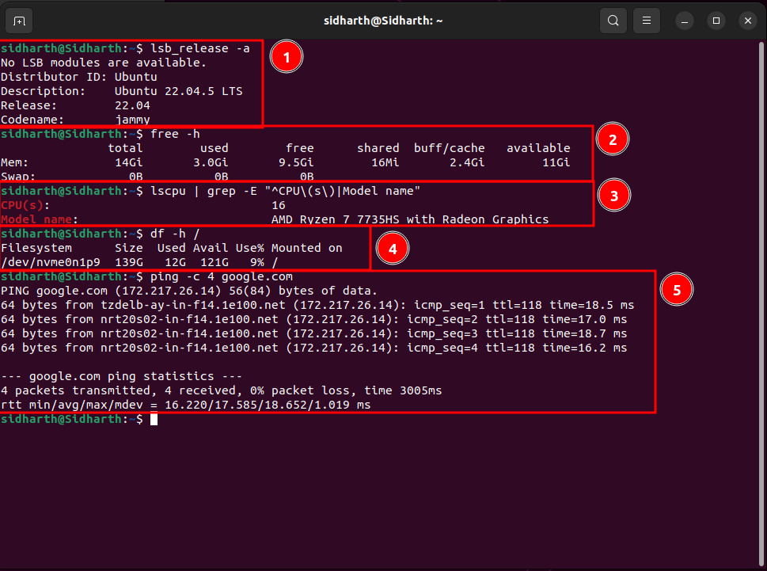

# 1.1 Prerequisites and Setup

## What You'll Learn

Before diving into drone simulation, we'll make sure you have:

- ✅ The right computer (hardware specifications)
- ✅ The right software (Ubuntu 22.04)
- ✅ Understanding of time commitment
- ✅ Proper expectations for the journey ahead

This ensures a smooth learning experience without technical roadblocks.

**Time:** 15-20 minutes reading + setup time (if needed)

---

## 🖥️ Hardware Requirements

### Minimum Requirements

Your computer needs **at least:**

| Component | Minimum | Recommended | Why? |
|-----------|---------|-------------|------|
| **OS** | Ubuntu 22.04 | Ubuntu 22.04 native | ArduPilot SITL runs on Linux |
| **CPU** | 4 cores, 2.0 GHz | 8 cores, 3.0 GHz+ | Gazebo simulation is CPU-intensive |
| **RAM** | 8 GB | 16 GB+ | Gazebo + ROS2 + SITL use memory |
| **Storage** | 30 GB free | 50 GB+ free | ArduPilot, ROS2, Gazebo, logs |
| **GPU** | Integrated graphics | Dedicated GPU | Better Gazebo visualization |
| **Internet** | Stable connection | High-speed | Downloading packages |

### Can I Use Windows or macOS?

**Short answer:** Use Ubuntu 22.04 (VM, dual-boot, or native).

**Why Ubuntu 22.04 specifically?**
- ArduPilot officially supports Ubuntu
- ROS2 Humble targets Ubuntu 22.04 LTS
- All our instructions tested on this version
- Strongest community support

**Don't have Ubuntu 22.04?** See **[Appendix: Ubuntu Installation](../appendix/ubuntu-install.md)** for detailed setup guides (VM, dual-boot, or native).

---

## 💿 Software Requirements

### Operating System

**Required:** Ubuntu 22.04 LTS (Jammy Jellyfish)

**Download:** https://ubuntu.com/download/desktop

**Why this specific version?**
- **LTS (Long Term Support)** — Stable, supported until 2027
- **ROS2 Humble** officially supports it
- **ArduPilot SITL** tested and documented for it
- **This tutorial** verified on this version

**Important:** 

- ❌ Don't use Ubuntu 20.04 (ROS2 Foxy is end-of-life)
- ❌ Don't use Ubuntu 24.04 (too new, compatibility issues)
- ❌ Other Linux distros (different package managers, untested)

**Need help installing Ubuntu?** See **[Appendix: Ubuntu Installation](../appendix/ubuntu-install.md)** for step-by-step guides.

---

### Software We'll Install (Later Sections)

Don't install these now — we'll do it step-by-step together:

**Phase 1 (Simulation):**
- ArduPilot SITL (Software In The Loop simulator)
- MAVProxy (Command-line ground control)
- Gazebo Harmonic (3D physics simulator)

**Phase 2 (ROS2 Integration):**
- ROS2 Humble (Robot Operating System)
- MAVROS (MAVLink ↔ ROS2 bridge)
- RViz (ROS visualization tool)

**Total download size:** ~10-15 GB  
**Total disk space after install:** ~25-30 GB

---

## ⏱️ Time Commitment

Be realistic about time investment to avoid frustration:

### Phase 1: Simulation (This Phase)

**Estimated:** 6-8 hours total

Spread over multiple sessions — don't rush! Understanding matters more than speed. Each section builds on previous ones.

**Suggested pace:**
- **Week 1:** Sections 1.1-1.3 (environment + SITL)
- **Week 2:** Sections 1.4-1.6 (control + Gazebo + missions)

### Full Tutorial (All 4 Phases)

**Estimated:** 40-60 hours total

- **Phase 1:** 6-8 hours (simulation)
- **Phase 2:** 12-16 hours (ROS2 integration)
- **Phase 3:** 8-12 hours (companion computer)
- **Phase 4:** 12-16 hours (real hardware)

**This assumes:**
- Following tutorials carefully
- Doing all verification steps
- Some troubleshooting time
- Not including hardware assembly

**Take your time.** Quality learning beats speed.

---

## 🎓 Knowledge Prerequisites

### What You DON'T Need to Know

You don't need prior experience with:

- ❌ ROS or ROS2
- ❌ ArduPilot or flight controllers
- ❌ Drone building or flying
- ❌ Advanced programming
- ❌ Robotics

**We teach all of this from scratch.**

---

### What Helps (But Not Required)

Nice to have, but we'll teach as we go:
- Basic Linux terminal commands (`cd`, `ls`, `mkdir`)
- Basic Python reading (not writing complex code)
- Understanding of 3D coordinates (x, y, z)
- Patience and willingness to troubleshoot

**Never used Linux terminal?** That's okay! We explain every command.

---

### Essential Mindset

What you **DO** need:

- ✅ **Patience** to follow step-by-step instructions
- ✅ **Attention to detail** (typos break things)
- ✅ **Willingness to read error messages** (they tell you what's wrong)
- ✅ **Comfort with trial and error** (part of learning)
- ✅ **Safety-first attitude** (especially for Phase 4 with real hardware)

**Approach:** Treat this as a journey, not a race. Every expert was once a beginner.

---

## 🛠️ Tools You'll Need

### For Phase 1 (Now)

You need right now:

- [ ] Computer meeting hardware requirements
- [ ] Ubuntu 22.04 installed
- [ ] Text editor (gedit, nano, or VS Code)
- [ ] Terminal application (built into Ubuntu)
- [ ] Stable internet connection

**That's it for now!** Everything else we'll install together in upcoming sections.

---

### For Later Phases

**Don't buy hardware yet!** Complete Phases 1-2 in simulation first.

**Phase 3 (Companion Computer):**
- Raspberry Pi 4 (4GB+ RAM recommended)
- MicroSD card (32GB+)
- USB cable or network connection

**Phase 4 (Real Hardware):**
- Flight controller (Pixhawk/Cube Orange)
- Drone frame and components
- RC transmitter and receiver
- Battery and charger
- Safety equipment
- Open outdoor space for testing

We'll provide detailed lists when you reach those phases.

---

## ✅ Verification Steps



### Check Your Ubuntu Version

Open terminal (Ctrl+Alt+T) and run:
```bash
lsb_release -a
```

**Expected output:**
```
Distributor ID: Ubuntu
Description:    Ubuntu 22.04.x LTS
Release:        22.04
Codename:       jammy
```

✅ **Success:** Shows Ubuntu 22.04  
❌ **Wrong version:** Install Ubuntu 22.04 before continuing

---

### Check System Resources

**Check RAM:**
```bash
free -h
```

**Look for:** `Mem:` line shows total RAM  
✅ **Success:** Shows 8GB or more  
⚠️ **Warning:** Less than 8GB will be slow

---

**Check CPU:**
```bash
lscpu | grep -E "^CPU\(s\)|Model name"
```

✅ **Success:** Shows 4+ CPUs  
⚠️ **Warning:** Fewer cores will be slower

---

**Check Disk Space:**
```bash
df -h /
```

**Look for:** `/` filesystem available space  
✅ **Success:** 30GB+ available  
❌ **Insufficient:** Free up space before continuing

---

### Test Internet Connection
```bash
ping -c 4 google.com
```

**Expected output:** Shows response times (e.g., "time=15.2 ms")  
✅ **Success:** Receives 4 packets  
❌ **Fail:** Check your network connection

---

## 📋 Pre-Flight Checklist

Before moving to next section, verify:

- [ ] ✅ Ubuntu 22.04 LTS installed and running
- [ ] ✅ System meets minimum requirements (8GB RAM, 4 cores, 30GB space)
- [ ] ✅ Internet connection working
- [ ] ✅ Comfortable opening terminal (Ctrl+Alt+T)
- [ ] ✅ Realistic time expectations set
- [ ] ✅ Ready to learn patiently

**All checked?** You're ready to proceed! 🚀

---

## 🎯 What You Accomplished

- ✅ Understood hardware and software requirements
- ✅ Confirmed Ubuntu 22.04 is installed (or know how to install it)
- ✅ Verified system meets requirements
- ✅ Set realistic expectations for journey ahead
- ✅ Prepared mindset for learning

---

## 🚀 Next Steps

Continue to **[1.2 Environment Setup](1.2-environment-setup.md)** where we'll:
- Update your system to latest packages
- Install essential development tools
- Configure your terminal (optional)
- Setup your workspace directory structure
- Prepare your system for ArduPilot SITL

---

## ❓ Common Questions

### Q: Can I use Ubuntu in WSL2 (Windows Subsystem for Linux)?

**A:** Not recommended. WSL2 has issues with:
- USB device access (needed later for flight controller)
- GUI applications (Gazebo, RViz need 3D graphics)
- Real-time performance

Use VM or dual-boot instead.

---

### Q: I have Ubuntu 20.04, do I need to upgrade?

**A:** Yes. ROS2 Foxy (for Ubuntu 20.04) reached end-of-life. This tutorial uses ROS2 Humble which requires Ubuntu 22.04.

---

### Q: Can I use a more powerful computer for better performance?

**A:** Absolutely! More RAM and CPU cores = smoother Gazebo simulation and faster builds. Recommended specs will give you the best experience.

---

### Q: Will this work on Ubuntu 24.04?

**A:** Not yet. Wait for ROS2 Jazzy to mature and ArduPilot to officially support it. Stick with Ubuntu 22.04 for now (LTS until 2027).

---

### Q: I'm stuck on installation. Where can I get help?

**A:** 
1. Check **[Appendix: Ubuntu Installation](../appendix/ubuntu-install.md)** for detailed guides
2. Search Ubuntu installation guides: https://ubuntu.com/tutorials/install-ubuntu-desktop
3. Search our issues: https://github.com/simtofly/simtofly-guide/issues
4. Open new issue with your specific problem

---

## 🐛 Troubleshooting

### Virtual Machine is Very Slow

**Solutions:**
1. Allocate more RAM (8GB → 12GB if host allows)
2. Allocate more CPU cores (2 → 4+ if available)
3. Enable 3D acceleration in VM settings
4. Close other applications on host machine
5. Consider dual-boot for better performance

---

### Ubuntu Won't Boot After Dual-Boot Install

**Solutions:**
1. Check BIOS boot order (Ubuntu should be first)
2. Repair GRUB bootloader (search: "repair grub ubuntu")
3. If stuck, seek help on Ubuntu forums with your specific setup

---

### System Requirements Not Met

**Solutions:**
1. **Low RAM:** Add more RAM to computer, or use lighter VM settings
2. **Low disk space:** Free up space, uninstall unused programs
3. **Slow CPU:** Be patient, or consider upgrading hardware
4. **No dedicated GPU:** Gazebo will work, just slower

---

[← Back to Phase 1 Overview](README.md) | [Next: 1.2 Environment Setup →](1.2-environment-setup.md)