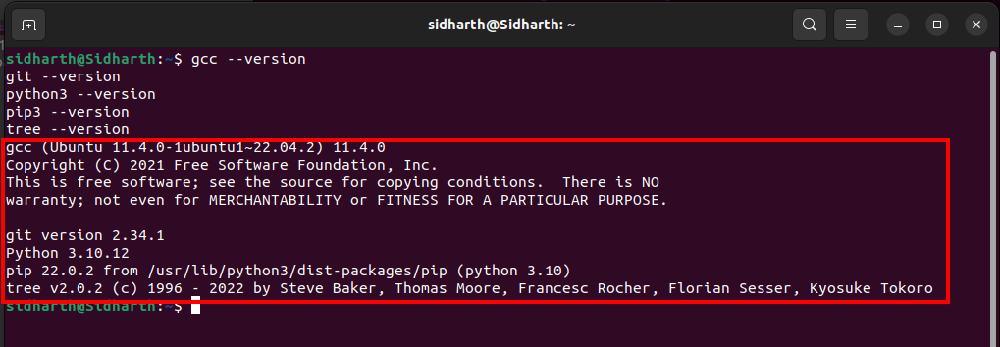
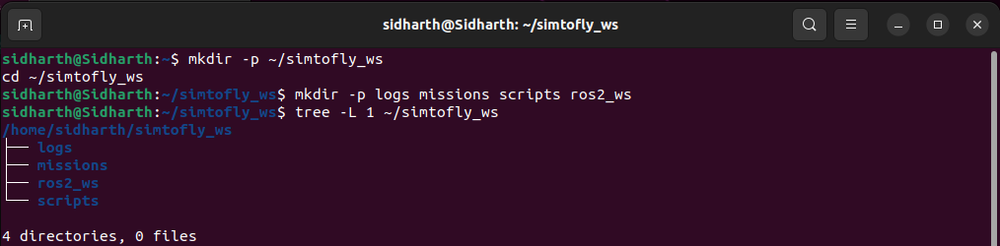

# 1.2 Environment Setup

## What You'll Learn

Prepare your Ubuntu system for drone development:

- Update system to latest packages
- Install essential development tools
- Create organized workspace structure  
- Verify everything is ready for ArduPilot SITL

**Time:** 15-20 minutes

---

## Prerequisites

Before starting, you must have completed:

- ✅ [1.1 Prerequisites and Setup](1.1-prerequisites.md)
- ✅ Ubuntu 22.04 LTS installed and booted
- ✅ Internet connection working
- ✅ System meets minimum requirements

---

## 📄 Update Your System

### Why Update First?

Before installing anything, ensure your system has:
- Latest security patches
- Updated package repositories
- Bug fixes and improvements

**This prevents compatibility issues later.**

---

### Update Commands

Open terminal (Ctrl+Alt+T) and run:
```bash
sudo apt update
```

**What this does:** Updates the list of available packages and versions.

**Expected output:**
```
Hit:1 http://archive.ubuntu.com/ubuntu jammy InRelease
Get:2 http://archive.ubuntu.com/ubuntu jammy-updates InRelease [119 kB]
...
Reading package lists... Done
```

✅ **Success:** No errors, shows "Reading package lists... Done"

---

Now upgrade installed packages:
```bash
sudo apt upgrade -y
```

**What this does:** Downloads and installs updates.

**This takes:** 5-15 minutes depending on pending updates.

**Expected output:**
```
Reading package lists... Done
Building dependency tree... Done
...
The following packages will be upgraded:
  [list of packages]
...
Setting up [package names]...
```

✅ **Success:** Completes without errors

---

### Clean Up

Remove unnecessary packages:
```bash
sudo apt autoremove -y
sudo apt autoclean
```

**What this does:** Frees disk space by removing unused packages.

---

### Reboot (Important!)
```bash
sudo reboot
```

**Why reboot?** Kernel updates require restart to take effect.

**After reboot:** Open terminal again and continue.

---

## 🛠️ Install Essential Development Tools

### Install Required Packages

ArduPilot and ROS2 need these tools:
```bash
sudo apt install -y \
    build-essential \
    git \
    python3 \
    python3-pip \
    python3-dev \
    curl \
    wget \
    nano \
    net-tools \
    tree
```

**What these are:**
- `build-essential` — C/C++ compiler (for building ArduPilot)
- `git` — Version control (to clone ArduPilot)
- `python3` — Python runtime (ArduPilot SITL uses Python)
- `python3-pip` — Python package installer
- `python3-dev` — Python development headers
- `curl`, `wget` — Download files from internet
- `nano` — Simple text editor
- `net-tools` — Network diagnostics
- `tree` — Directory structure visualization

**This takes:** 2-5 minutes

**Expected output:**
```
Reading package lists... Done
Building dependency tree... Done
...
Setting up build-essential...
Setting up git...
...
```

✅ **Success:** All packages installed without errors

---

### Verify Installation
```bash
gcc --version
git --version
python3 --version
pip3 --version
tree --version
```

**Expected output:**



```
gcc (Ubuntu 11.x.x) ...
git version 2.34.x
Python 3.10.x
pip 22.x.x from ...
tree v1.8.x
```

✅ **Success:** All tools show version numbers

---

## 📁 Create Workspace Structure

### Why Organized Workspace?

Having a clear structure prevents:
- Files scattered everywhere
- Forgetting where you saved things
- Conflicts between different projects

All SimToFly work will be in one place: `~/simtofly_ws/`

---

### Create Main Workspace
```bash
mkdir -p ~/simtofly_ws
cd ~/simtofly_ws
```

**What this creates:** Main folder for all SimToFly work.

---

### Create Subdirectories
```bash
mkdir -p logs missions scripts ros2_ws
```

**What each folder is for:**
- `logs/` — Flight logs and telemetry data
- `missions/` — Mission files and waypoints
- `scripts/` — Helper scripts and tools
- `ros2_ws/` — ROS2 workspace (Phase 2)

**Note:** We'll create the `ardupilot/` folder in Section 1.3 when we clone ArduPilot repository.

---

### Verify Structure
```bash
tree -L 1 ~/simtofly_ws
```

**Expected output:**



```
/home/your-username/simtofly_ws
├── logs
├── missions
├── ros2_ws
└── scripts

4 directories, 0 files
```

✅ **Success:** Four directories created

---

### Add Workspace Environment Variable

Make it easy to access workspace from anywhere:
```bash
echo 'export SIMTOFLY_WS=~/simtofly_ws' >> ~/.bashrc
source ~/.bashrc
```

**What this does:** Creates a shortcut variable to your workspace.

---

### Test Workspace Variable
```bash
echo $SIMTOFLY_WS
cd $SIMTOFLY_WS
pwd
```

**Expected output:**


```
/home/your-username/simtofly_ws
```

✅ **Success:** Can access workspace via `$SIMTOFLY_WS`

---

## 🧪 System Check and Verification

### Create Verification Script

Let's create a script to check everything is ready:
```bash
nano ~/simtofly_ws/scripts/check_environment.sh
```

**Paste this script:**
```bash
#!/bin/bash

echo "=========================================="
echo "SimToFly Environment Check"
echo "=========================================="
echo ""

# Check Ubuntu version
echo "Checking Ubuntu version..."
if lsb_release -d | grep -q "22.04"; then
    echo "✅ Ubuntu 22.04 detected"
else
    echo "❌ Wrong Ubuntu version. Need 22.04"
    lsb_release -d
fi
echo ""

# Check disk space
echo "Checking disk space..."
AVAILABLE=$(df -BG / | tail -1 | awk '{print $4}' | sed 's/G//')
if [ "$AVAILABLE" -gt 30 ]; then
    echo "✅ Sufficient disk space: ${AVAILABLE}GB available"
else
    echo "⚠️ Low disk space: ${AVAILABLE}GB available (need 30GB+)"
fi
echo ""

# Check RAM
echo "Checking RAM..."
TOTAL_RAM=$(free -g | awk '/^Mem:/{print $2}')
if [ "$TOTAL_RAM" -ge 7 ]; then
    echo "✅ Sufficient RAM: ${TOTAL_RAM}GB"
else
    echo "⚠️ Low RAM: ${TOTAL_RAM}GB (recommended 8GB+)"
fi
echo ""

# Check essential tools
echo "Checking essential tools..."
TOOLS=("gcc" "g++" "make" "git" "python3" "pip3" "tree")
for tool in "${TOOLS[@]}"; do
    if command -v $tool &> /dev/null; then
        echo "✅ $tool installed"
    else
        echo "❌ $tool NOT installed"
    fi
done
echo ""

# Check workspace structure
echo "Checking workspace structure..."
DIRS=("logs" "missions" "scripts" "ros2_ws")
for dir in "${DIRS[@]}"; do
    if [ -d "$HOME/simtofly_ws/$dir" ]; then
        echo "✅ $dir directory exists"
    else
        echo "❌ $dir directory missing"
    fi
done
echo ""

# Check internet
echo "Checking internet connection..."
if ping -c 1 google.com &> /dev/null; then
    echo "✅ Internet connection working"
else
    echo "❌ No internet connection"
fi
echo ""

echo "=========================================="
echo "Environment check complete!"
echo "=========================================="
```

**Save and exit:** Ctrl+X, then Y, then Enter

---

### Make Script Executable
```bash
chmod +x ~/simtofly_ws/scripts/check_environment.sh
```

---

### Run Verification
```bash
~/simtofly_ws/scripts/check_environment.sh
```

**Expected output:**


```
==========================================
SimToFly Environment Check
==========================================

Checking Ubuntu version...
✅ Ubuntu 22.04 detected

Checking disk space...
✅ Sufficient disk space: 45GB available

Checking RAM...
✅ Sufficient RAM: 8GB

Checking essential tools...
✅ gcc installed
✅ g++ installed
✅ make installed
✅ git installed
✅ python3 installed
✅ pip3 installed
✅ tree installed

Checking workspace structure...
✅ logs directory exists
✅ missions directory exists
✅ scripts directory exists
✅ ros2_ws directory exists

Checking internet connection...
✅ Internet connection working

==========================================
Environment check complete!
==========================================
```

✅ **All checks pass:** Your environment is ready!

⚠️ **Some checks fail:** Review and fix issues before continuing.

---

## 📋 Final Checklist

Before moving to next section, verify:

- [ ] ✅ System fully updated (`apt update && upgrade`)
- [ ] ✅ Rebooted after updates
- [ ] ✅ Essential tools installed (gcc, git, python3, tree)
- [ ] ✅ Workspace structure created (`~/simtofly_ws/`)
- [ ] ✅ Verification script runs successfully
- [ ] ✅ All checks in verification script pass

**All checked?** You're ready for ArduPilot SITL! 🚀

---

## 🎯 What You Accomplished

- ✅ Updated Ubuntu to latest packages
- ✅ Installed development tools (gcc, git, python3)
- ✅ Created organized workspace structure
- ✅ Set up workspace environment variable
- ✅ Created verification script for future checks
- ✅ Verified environment is ready

**Your system is now ready for ArduPilot SITL installation!**

---

## 🚀 Next Steps

Continue to **[1.3 ArduPilot SITL Installation](1.3-ardupilot-sitl.md)** where we'll:
- Clone ArduPilot source code
- Install ArduPilot dependencies
- Build SITL simulator
- Launch your first virtual drone
- Test basic commands

---

## ❓ Common Questions

### Q: Do I need to run the verification script every time?

**A:** No, just once now to confirm setup. Run it again only if something breaks later.

---

### Q: Can I use a different workspace location?

**A:** Yes, but stick with `~/simtofly_ws/` for consistency with this tutorial. If you change it, you'll need to adapt all commands.

---

### Q: The update took very long, is this normal?

**A:** Yes, first update after fresh Ubuntu install can take 15-30 minutes depending on internet speed and pending updates.

---

### Q: I got errors during `apt upgrade`, what do I do?

**A:** Read the error message carefully. Common fixes:
- Run `sudo apt --fix-broken install`
- Try `sudo dpkg --configure -a`
- Reboot and try again
- Search the specific error online

---

### Q: Why don't we create the ardupilot folder here?

**A:** We'll clone ArduPilot directly in Section 1.3, which automatically creates the `ardupilot/` directory. Creating it now would cause confusion with nested paths.

---

## 🐛 Troubleshooting

### "Unable to locate package" errors

**Cause:** Package repositories not updated

**Solution:**
```bash
sudo apt update
sudo apt install -y [package-name]
```

---

### "Permission denied" when creating directories

**Cause:** Trying to create in protected location

**Solution:** Make sure you're creating in your home directory (`~/`), not system directories like `/opt/` or `/usr/`.

---

### Verification script shows "command not found"

**Cause:** Script doesn't have execute permission

**Solution:**
```bash
chmod +x ~/simtofly_ws/scripts/check_environment.sh
```

---

### Terminal changes don't apply

**Cause:** Didn't reload bashrc

**Solution:**
```bash
source ~/.bashrc
```

Or close and reopen terminal.

---

### Some packages fail to install

**Cause:** Broken dependencies or repository issues

**Solution:**
```bash
sudo apt --fix-broken install
sudo apt update
sudo apt install -y [package-names]
```

---

[← Back: 1.1 Prerequisites](1.1-prerequisites.md) | [Next: 1.3 ArduPilot SITL →](1.3-ardupilot-sitl.md)