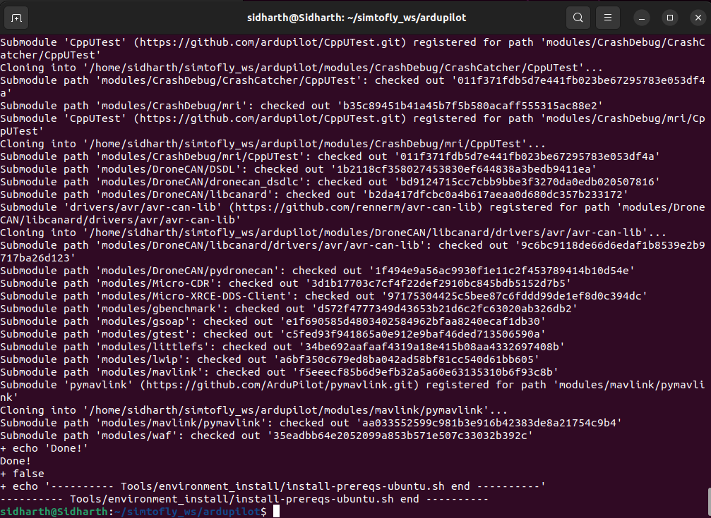
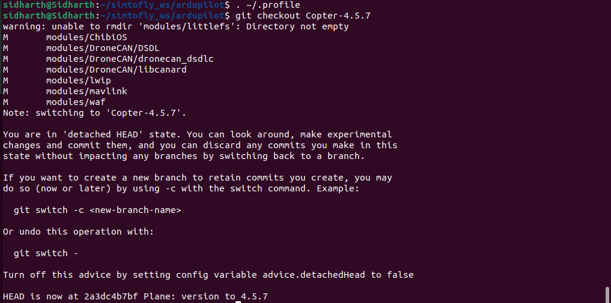
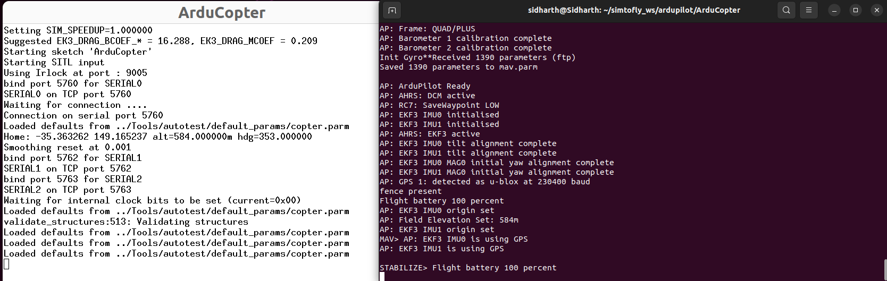
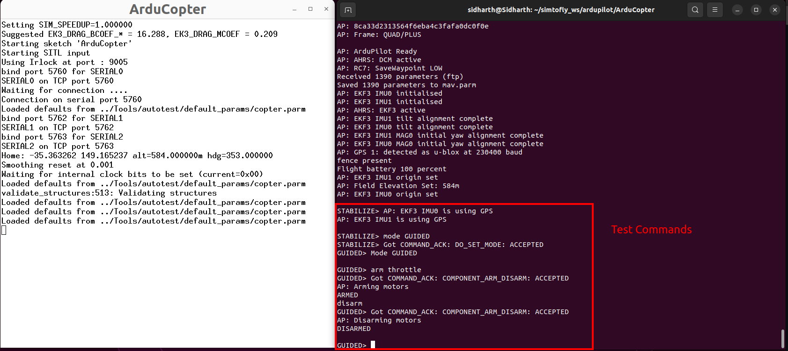

# 1.3 ArduPilot SITL Installation

## What You'll Learn

Install and launch your first virtual drone:

- What SITL is and why we use it
- Clone ArduPilot source code
- Install ArduPilot dependencies
- Build SITL simulator
- Launch your first virtual drone
- Verify SITL works correctly

**Time:** 45-60 minutes

---

## Prerequisites

Before starting, you must have completed:

- ✅ [1.1 Prerequisites and Setup](1.1-prerequisites.md)
- ✅ [1.2 Environment Setup](1.2-environment-setup.md)
- ✅ Workspace created at `~/simtofly_ws/`
- ✅ Internet connection working

---

## What is SITL?

**SITL** = Software In The Loop

Think of SITL as a **virtual drone** that runs entirely on your computer:
- No physical hardware needed
- Same ArduPilot firmware as real drone
- Safe to crash and experiment
- Perfect for testing code before real flights

**Why start with SITL?**
- Learn without risk of damaging hardware
- Test missions before flying
- Develop code in safety
- Everything you learn transfers to real drones

### How SITL Works


---

## Clone ArduPilot Repository

### Navigate to Workspace
```bash
cd ~/simtofly_ws/
```

### Clone ArduPilot Source
```bash
git clone https://github.com/ArduPilot/ardupilot.git
cd ardupilot
```

**What this does:** Downloads ArduPilot source code to your computer.

**This takes:** 2-5 minutes depending on internet speed.

**Expected output:**
```
Cloning into 'ardupilot'...
remote: Enumerating objects: xxxxx, done.
remote: Counting objects: 100% (xxxxx/xxxxx), done.
...
Resolving deltas: 100% (xxxxx/xxxxx), done.
```

✅ **Success:** Clone completes without errors

---

### Verify Clone
```bash
cd ~/simtofly_ws/ardupilot/
ls
```

**Expected output:** You should see directories like:


```
ArduCopter  ArduPlane  ArduSub  libraries  Tools  ...
```

✅ **Success:** ArduPilot directories visible

---

## Install ArduPilot Dependencies

### Run Installation Script

ArduPilot provides a script that installs everything needed:

```bash
cd ~/simtofly_ws/ardupilot/
Tools/environment_install/install-prereqs-ubuntu.sh -y
```

**What this does:** Installs compilers, libraries, and tools ArduPilot needs.

**This takes:** 10-20 minutes (downloads ~2GB of packages).

**Expected output:**




```
---------- Installing prerequisites for SITL ----------
...
Installing packages...
...
Finished installing prerequisites
```

✅ **Success:** Script completes with "Finished installing prerequisites"

---

### Reload Your Profile

The installation script modifies your environment. Reload it:
```bash
. ~/.profile
```

**Alternative (same result):**
```bash
source ~/.profile
```

---

## Initialize Submodules

ArduPilot uses additional code libraries called submodules.

### ⚠️ Configure Git for Submodules (If Needed)

**Most users can skip this step.** Only needed if you have git protocol issues or are behind a firewall.

** ⚠️ If submodule update fails in the next step, come back here and run: ⚠️**

```bash
git config --global url.https://.insteadOf git://
```

Then retry the submodule update command.

---

### Checkout Stable Version

We'll use ArduCopter 4.5.7 (current stable as of December 2025):
```bash
cd ~/simtofly_ws/ardupilot/
git checkout Copter-4.5.7
```

**Expected output:**



```
Note: switching to 'Copter-4.5.7'.
...
HEAD is now at xxxxxxx ArduCopter: release 4.5.7
```

✅ **Success:** Switched to Copter-4.5.7

---

### Update Submodules
```bash
git submodule update --init --recursive
```

**What this does:** Downloads additional required libraries.

**This takes:** 5-10 minutes.

**Expected output:**
```
Submodule 'modules/xxx' registered for path 'modules/xxx'
...
Cloning into '/home/.../ardupilot/modules/xxx'...
...
Submodule path 'modules/xxx': checked out 'xxxxxx'
```

✅ **Success:** All submodules initialized without errors

---

## First SITL Launch

### Initial Parameter Setup

The first time you run SITL, it needs to set default parameters:
```bash
cd ~/simtofly_ws/ardupilot/ArduCopter
sim_vehicle.py -w
```

**Important flags:**

- `-w` = Wipe parameters and start fresh

**What this does:** 

- Builds SITL for the first time
- Sets default ArduCopter parameters
- Creates configuration files

**This takes:** 2-5 minutes (first build is slow).

**Expected output:**

```
Building ArduCopter...
...
Configuring for SITL...
...
Init ArduCopter V4.5.7
...
Received 500 parameters
...
```

**Wait until you see:** `Received XXX parameters` (where XXX is around 500-600)

**Then:** Press Ctrl+C to exit

✅ **Success:** Parameters received, SITL built successfully

---

### Verify sim_vehicle.py is Accessible

The installation should have added sim_vehicle.py to your PATH. Verify:
```bash
which sim_vehicle.py
```

**Expected output:**
```
/home/your-username/simtofly_ws/ardupilot/Tools/autotest/sim_vehicle.py
```

**If command not found:**
```bash
echo 'export PATH=$PATH:$HOME/simtofly_ws/ardupilot/Tools/autotest' >> ~/.bashrc
source ~/.bashrc
```

---

## ✅ Test SITL Launch

### Launch SITL Simulator

Now let's launch SITL properly:
```bash
cd ~/simtofly_ws/ardupilot/ArduCopter
sim_vehicle.py -v ArduCopter
```

**What this does:** Starts ArduCopter SITL simulator.

**Expected output:**



```
Starting SITL...
Waiting for heartbeat from 127.0.0.1:5760
...
Init ArduCopter V4.5.7 (xxxxxxx)
...
APM: ArduCopter V4.5.7
...
Received 500 parameters
```

**You should see a prompt:**
```
STABILIZE>
```

✅ **Success:** SITL is running, you're in STABILIZE mode

---

### Test Basic Commands

At the `STABILIZE>` prompt, try these commands:

**Check mode:**
```
mode GUIDED
```

**Expected response:**
```
GUIDED> 
```

**Arm the motors:**
```
arm throttle
```

**Expected response:**
```
ARMED
```

**Disarm:**
```
disarm
```

**Expected response:**
```
DISARMED
```



✅ **Success:** Commands work, SITL responds

---

### Exit SITL

To stop SITL, press:
```
Ctrl+C
```

---

## Verification Checklist

Before moving to next section, verify:

- [ ] ArduPilot cloned to `~/simtofly_ws/ardupilot/`
- [ ] Dependencies installed (install-prereqs script completed)
- [ ] Submodules initialized (no errors)
- [ ] Checked out Copter-4.5.7
- [ ] First launch with `-w` flag completed
- [ ] `sim_vehicle.py` accessible from terminal
- [ ] SITL launches and shows `STABILIZE>` prompt
- [ ] Can change modes (GUIDED works)
- [ ] Can arm/disarm vehicle

**All checked?** Your SITL is ready!

---

## What You Accomplished

- ✅ Downloaded ArduPilot source code
- ✅ Installed all required dependencies
- ✅ Built SITL from source
- ✅ Launched your first virtual drone
- ✅ Tested basic commands (mode, arm, disarm)
- ✅ Verified SITL installation works

---

## Next Steps

Continue to **[1.4 MAVProxy Command Line](1.4-mavproxy-basics.md)** where we'll:

- Understand flight modes
- Control drone via commands
- Perform takeoff and landing
- Navigate with basic movements

---

## Common Questions

### Q: Why Copter-4.5.7 specifically?

**A:** This is the latest stable release as of December 2025. It's well-tested and widely used. You can use newer versions when they're released, but this tutorial is verified with 4.5.7.

### Q: Can I use a different vehicle type?

**A:** Yes! ArduPilot supports:

- `ArduCopter` — Multirotor drones (what we use)
- `ArduPlane` — Fixed-wing aircraft
- `ArduSub` — Underwater vehicles
- `Rover` — Ground vehicles

Replace `ArduCopter` with your vehicle type in commands.

### Q: What's the difference between `-w` and normal launch?

**A:** 

- `-w` flag: Wipes parameters, sets defaults (use first time only)
- Normal launch: Uses saved parameters (use after first time)

### Q: Do I need to be in ArduCopter directory to launch?

**A:** No, if `sim_vehicle.py` is in your PATH. But starting there is good practice.

### Q: How much disk space does ArduPilot use?

**A:** 

- Source code: ~2 GB
- Built SITL: ~3 GB
- Total: ~5 GB

---

## Troubleshooting

### Error: "command not found: sim_vehicle.py"

**Cause:** sim_vehicle.py not in PATH

**Solution:**
```bash
echo 'export PATH=$PATH:$HOME/simtofly_ws/ardupilot/Tools/autotest' >> ~/.bashrc
source ~/.bashrc
```

Then try launching again.

---

### Error: "Failed to download submodules"

**Cause:** Network issues or git protocol blocked

**Solution:**
```bash
git config --global url.https://.insteadOf git://
git submodule update --init --recursive
```

---

### Error: "Building failed" or compiler errors

**Cause:** Missing dependencies

**Solution:**
```bash
cd ~/simtofly_ws/ardupilot/ardupilot
Tools/environment_install/install-prereqs-ubuntu.sh -y
. ~/.profile
```

Then try building again.

---

### Error: "No module named 'pymavlink'"

**Cause:** Python dependencies not installed

**Solution:**
```bash
pip3 install --user pymavlink MAVProxy
```

---

### SITL launches but no "Received parameters" message

**Cause:** First launch without `-w` flag

**Solution:**
```bash
cd ~/simtofly_ws/ardupilot/ArduCopter
sim_vehicle.py -w
```

Wait for parameters, then Ctrl+C and relaunch normally.

---

### "Permission denied" errors during installation

**Cause:** Trying to install in system directories

**Solution:** Make sure you're in `~/simtofly_ws/` (your home directory), not `/opt/` or `/usr/`.

---

### Build is very slow

**Cause:** Limited CPU cores or running in VM

**Solution:**

- Be patient (first build takes time)
- Close other applications
- Subsequent builds will be faster
- Consider native Ubuntu instead of VM for better performance

---

[← Back: 1.2 Environment Setup](1.2-environment-setup.md) | [Next: 1.4 MAVProxy Basics →](1.4-mavproxy-basics.md)