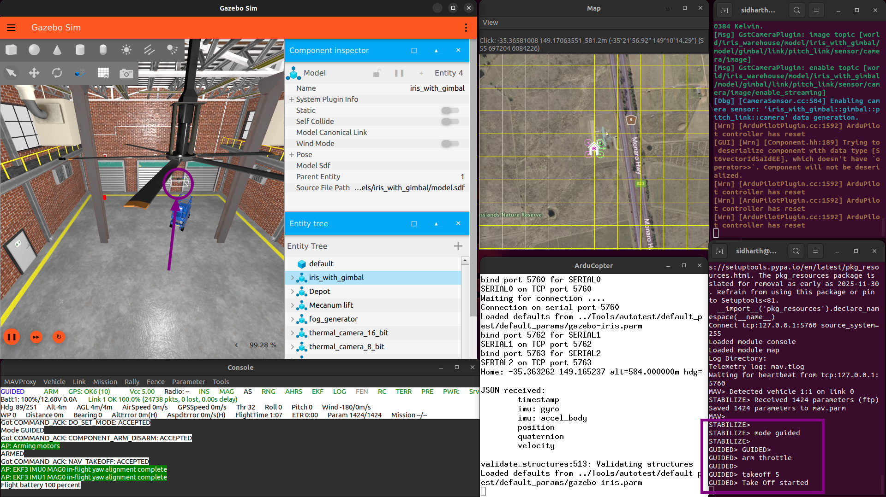

# 1.5 Gazebo Simulation

## What You'll Learn

Add realistic 3D visualization to your drone simulations:

- ✅ What Gazebo is and why we use it
- ✅ Install Gazebo Harmonic
- ✅ Install ArduPilot Gazebo plugin
- ✅ Launch SITL with Gazebo visualization
- ✅ Understand Gazebo interface
- ✅ Control drone with 3D feedback
- ✅ Verify physics simulation works

**Time:** 30-60 minutes

---

## Prerequisites

Before starting, you must have completed:

- ✅ [1.1 Prerequisites and Setup](1.1-prerequisites.md)
- ✅ [1.2 Environment Setup](1.2-environment-setup.md)
- ✅ [1.3 ArduPilot SITL Installation](1.3-ardupilot-sitl.md)
- ✅ [1.4 MAVProxy Command Line](1.4-mavproxy-basics.md)
- ✅ SITL launches and accepts commands
- ✅ Can control drone via MAVProxy

---

## 🤔 What is Gazebo?

**Gazebo** = Advanced 3D robot simulator

It provides:

- **Realistic physics** — Gravity, inertia, collisions
- **3D visualization** — See your drone in realistic environment
- **Sensor simulation** — Camera, GPS, IMU, lidar
- **Environmental factors** — Wind, lighting, terrain

**Why add Gazebo to SITL?**

SITL alone:

- ❌ No visual feedback (just text/map)
- ❌ No realistic physics
- ❌ No sensor simulation

SITL + Gazebo:

- ✅ See drone in 3D world
- ✅ Realistic flight physics
- ✅ Test sensors before real hardware
- ✅ Better understanding of behavior

**Later (Phase 2):** We'll add ROS2 sensors in Gazebo.

---

## 📦 Install Gazebo Harmonic

### Why Gazebo Harmonic?

**Gazebo Harmonic** (released 2024) is the recommended version:

- Latest LTS (Long Term Support) release
- Best Ubuntu 22.04 support
- Officially supported by ArduPilot
- Active development and updates

**Official documentation:** https://gazebosim.org/docs/harmonic/install_ubuntu

---

### Install Required Tools

First, ensure required tools are installed:
```bash
sudo apt update
sudo apt install curl lsb-release gnupg -y
```

**What these are:**

- `curl` — Download files from internet
- `lsb-release` — Detect Ubuntu version
- `gnupg` — Verify package signatures

---

### Add Gazebo Repository

**Add Gazebo GPG key:**
```bash
sudo curl https://packages.osrfoundation.org/gazebo.gpg --output /usr/share/keyrings/pkgs-osrf-archive-keyring.gpg
```

**Add repository to sources list:**
```bash
echo "deb [arch=$(dpkg --print-architecture) signed-by=/usr/share/keyrings/pkgs-osrf-archive-keyring.gpg] https://packages.osrfoundation.org/gazebo/ubuntu-stable $(lsb_release -cs) main" | sudo tee /etc/apt/sources.list.d/gazebo-stable.list > /dev/null
```

**What this does:** Adds official Gazebo Harmonic repository to your system.

---

### Update Package List
```bash
sudo apt update
```

---

### Install Gazebo Harmonic
```bash
sudo apt install gz-harmonic -y
```

**What this installs:** Complete Gazebo Harmonic suite.

**This takes:** 5-10 minutes (downloads ~1-2GB).

**Expected output:**
```
Reading package lists... Done
Building dependency tree... Done
...
Setting up gz-harmonic...
```

✅ **Success:** Installation completes without errors

---

### Verify Gazebo Installation
```bash
gz sim --version
```

**Expected output:**


```
Gazebo Sim, version 8.x.x
```

✅ **Success:** Shows Gazebo Sim version 8.x (Harmonic)

---

### Test Gazebo Launch
```bash
gz sim -v4 shapes.sdf
```


**What happens:**

- Gazebo window opens
- Shows world with various 3D shapes
- May take 10-20 seconds on first launch

**If window opens:** ✅ Gazebo installed correctly

**Close Gazebo:** File → Exit (or Ctrl+C in terminal)

---

## 🔌 Install ArduPilot Gazebo Plugin

### What is the Plugin?

The **ArduPilot Gazebo plugin** connects:

- ArduPilot SITL ↔ Gazebo simulator
- Sends motor commands from ArduPilot to Gazebo
- Sends sensor data from Gazebo to ArduPilot

**Without plugin:** SITL and Gazebo can't communicate.

**Official repository:** https://github.com/ArduPilot/ardupilot_gazebo

---

### Install Dependencies

ArduPilot Gazebo plugin requires these packages:
```bash
sudo apt update
sudo apt install libgz-sim8-dev rapidjson-dev -y
```
```bash
sudo apt install libopencv-dev libgstreamer1.0-dev libgstreamer-plugins-base1.0-dev gstreamer1.0-plugins-bad gstreamer1.0-libav gstreamer1.0-gl -y
```

**What these are:**

- `libgz-sim8-dev` — Gazebo Harmonic development libraries
- `rapidjson-dev` — JSON parsing library (for communication)
- `libopencv-dev` — Computer vision library (required for camera sensors)
- `libgstreamer*` — Video streaming libraries (required for plugin compilation)

**This takes:** 5-10 minutes

**Expected output:**
```
Reading package lists... Done
Building dependency tree... Done
...
Setting up libopencv-dev...
Setting up libgstreamer1.0-dev...
...
```

✅ **Success:** All packages installed without errors

---

### Clone ArduPilot Gazebo Plugin
```bash
cd ~/simtofly_ws
git clone https://github.com/ArduPilot/ardupilot_gazebo.git
```

**This takes:** 1-2 minutes.

**Expected output:**
```
Cloning into 'ardupilot_gazebo'...
remote: Enumerating objects: ...
...
Resolving deltas: 100% (xxx/xxx), done.
```

✅ **Success:** Repository cloned

---

### Build the Plugin
```bash
cd ~/simtofly_ws/ardupilot_gazebo
mkdir build && cd build
cmake .. -DCMAKE_BUILD_TYPE=RelWithDebInfo
make -j4
```

**Command breakdown:**

- `mkdir build && cd build` — Create build directory
- `cmake ..` — Configure build system
- `-DCMAKE_BUILD_TYPE=RelWithDebInfo` — Optimized build with debug info
- `make -j4` — Build using 4 CPU cores

**This takes:** 5-10 minutes.

**Expected output:**
```
-- The C compiler identification is GNU 11.x.x
-- The CXX compiler identification is GNU 11.x.x
...
-- Compiling against Gazebo Harmonic
-- RapidJSON found. Headers: /usr/include
-- OpenCV found
...
[ 25%] Building CXX object ...
[ 50%] Building CXX object ...
[ 75%] Building CXX object ...
[100%] Built target ArduPilotPlugin
```

✅ **Success:** Shows "[100%] Built target ArduPilotPlugin"


---

## ⚙️ Configure Environment Variables

### Add Plugin to Gazebo's Search Path

Gazebo needs to know where to find the plugin and models.

**Add environment variables:**
```bash
echo 'export GZ_SIM_SYSTEM_PLUGIN_PATH=$HOME/simtofly_ws/ardupilot_gazebo/build:${GZ_SIM_SYSTEM_PLUGIN_PATH}' >> ~/.bashrc
```
```bash
echo 'export GZ_SIM_RESOURCE_PATH=$HOME/simtofly_ws/ardupilot_gazebo/models:$HOME/simtofly_ws/ardupilot_gazebo/worlds:${GZ_SIM_RESOURCE_PATH}' >> ~/.bashrc
```

**What these do:**

- First line: Tells Gazebo where to find the ArduPilot plugin
- Second line: Tells Gazebo where to find drone models and simulation worlds

---

### Apply Changes
```bash
source ~/.bashrc
```

---

### Verify Environment Variables
```bash
echo $GZ_SIM_SYSTEM_PLUGIN_PATH
echo $GZ_SIM_RESOURCE_PATH
```

**Expected output:** Should show paths to your plugin and models directories.

✅ **Success:** Paths displayed correctly

---

## 🚁 Launch SITL with Gazebo

### Start Gazebo First

Open **Terminal 1:**
```bash
gz sim -v4 -r iris_runway.sdf
```

**Command breakdown:**

- `gz sim` — Launch Gazebo simulator
- `-v4` — Verbose output (helpful for troubleshooting)
- `-r` — Run simulation immediately (not paused)
- `iris_runway.sdf` — Quadcopter on runway world

**This takes:** 10-20 seconds to load.

**Expected result:**

- Gazebo window opens
- Shows runway environment
- Drone (iris quadcopter) visible on runway

✅ **Success:** See drone in Gazebo world

---

### Start SITL

Open **Terminal 2** (keep Gazebo running in Terminal 1):
```bash
cd ~/simtofly_ws/ardupilot/ArduCopter
sim_vehicle.py -v ArduCopter -f gazebo-iris --model JSON --map --console
```

**Command breakdown:**
- `-v ArduCopter` — Vehicle type (multirotor)
- `-f gazebo-iris` — Use Gazebo with iris model
- `--model JSON` — Use JSON protocol for communication
- `--map` — Open map window
- `--console` — Open console window

**This takes:** 10-15 seconds.

**Expected output:**
```
Starting SITL...
Waiting for JSON sensor data...
Received sensor data from Gazebo
...
APM: ArduCopter V4.5.7 (...)
...
STABILIZE>
```

✅ **Success:** Shows "Received sensor data from Gazebo" and `STABILIZE>` prompt

---

### Verify Connection


**In Gazebo window:**
- Drone should be sitting on runway
- Propellers visible

**In SITL console window:**
- Shows flight mode (STABILIZE)
- GPS status should be good

**In map window:**
- Drone position displayed

✅ **Success:** All windows show drone data

**Here's a quick reference of what each window does:**

| Window # | Name | Purpose |
|----------|------|---------|
| 1 | Gazebo Launch Terminal | Gazebo output logs and messages |
| 2 | Gazebo 3D Simulator | 3D visualization of drone and environment |
| 3 | SITL Main Terminal | Enter MAVProxy commands (arm, takeoff, etc.) |
| 4 | MAVProxy Status | System messages, errors, and status updates |
| 5 | MAVProxy 2D Map | Top-down view of drone position and waypoints |
| 6 | MAVProxy Console | Real-time telemetry (altitude, speed, battery, GPS) |

**Note:** Windows 1-2 are the Gazebo simulator running separately, while Windows 3-6 all are part of MAVProxy/SITL.

---

## 🎮 Test Flight in Gazebo

### Arm and Takeoff

In SITL terminal (Terminal 2):
```bash
mode GUIDED
```
```bash
arm throttle
```
```bash
takeoff 10
```

**Watch in Gazebo:**
- Propellers start spinning
- Drone lifts off ground
- Climbs to 10 meters
- Physics looks realistic (smooth acceleration)

**This takes:** 10-20 seconds to reach altitude.


✅ **Success:** Drone flies in Gazebo, hovers at 10m

---

### Navigate in Gazebo

**Using MAVProxy map window (easiest method):**

1. In the MAVProxy map window, right-click where you want drone to go
2. Select `Fly to`
3. Drone automatically flies to position and holds

**Watch in Gazebo:**

- Drone tilts in flight direction
- Moves smoothly to new position
- Realistic flight physics
- Automatically holds position when reached

**Try clicking different locations on the map to see the drone respond!**

---
**Return to Launch:**
```bash
mode RTL
```

Drone automatically returns to takeoff position.

**OR**

### Land
```bash
land
```

**Watch in Gazebo:**
- Drone descends smoothly
- Touches down on runway
- Propellers stop spinning
- Automatically disarms

✅ **Success:** Complete flight in 3D simulation

---

## 🎨 Understanding Gazebo Interface


### Main Window Elements

**Top Left Toolbar:**

- Shape and transform tools
- Screenshot

**Right Panel:**

- **Top:** Model properties (pose, settings)
- **Bottom:** Entity Tree (list of objects)
- Select objects to inspect and modify

**Bottom Left:**

- Play/Pause button
- Real-time factor (simulation speed)

**Center:**

- 3D visualization
- Main view of drone and environment

---

### Camera Controls

Use mouse to navigate the view:

- **Left-drag:** Rotate view around point
- **Middle-drag:** Pan view (move camera position)
- **Right-drag:** Zoom in/out
- **Scroll wheel:** Zoom in/out
- **Shift + Left-drag:** Look around (first-person style)

---

### Useful View Controls


1. Right-click on `iris_with_gimbal` in Entity Tree (right panel, bottom section)

2. Many options like `Move To`, `Follow Options` (Follow, Free Look, Look At), `Track`, `Remove`, `Copy`, `Paste`, `View` ( Center of Mass, Collisions, Inertia, Joints, Frams, Transparent, Wireframe)


---

## 🌍 Different Gazebo Worlds

### Available Worlds

The plugin includes several environments:

**iris_runway.sdf** — Drone on runway (default, fast loading)  
**iris_maze.sdf** — Indoor maze environment  
**iris_warehouse.sdf** — Indoor warehouse with obstacles

---

### Launch Different World

**Example: Launch in warehouse:**

**Terminal 1:**
```bash
gz sim -v4 -r iris_warehouse.sdf
```

**⏳ Note:** The warehouse world may take **3-5 minutes** to load on first launch. It downloads 3D models from the internet, so ensure you have a **stable internet connection**. The Gazebo window may appear frozen during download — this is normal. Subsequent launches will be much faster as models are cached locally.

**Terminal 2:**
```bash
cd ~/simtofly_ws/ardupilot/ArduCopter
sim_vehicle.py -v ArduCopter -f gazebo-iris --model JSON --map --console
```



**Try different worlds to test various flight scenarios!**

---

## 📋 Verification Checklist

Before moving to next section, verify:

- [ ] ✅ Gazebo Harmonic installed (version 8.x)
- [ ] ✅ ArduPilot Gazebo plugin built successfully
- [ ] ✅ Environment variables set correctly
- [ ] ✅ Gazebo launches with drone model
- [ ] ✅ SITL connects to Gazebo (sees sensor data)
- [ ] ✅ Can arm and takeoff in Gazebo
- [ ] ✅ Drone physics looks realistic
- [ ] ✅ Can navigate and land successfully
- [ ] ✅ Understand Gazebo interface controls

**All checked?** You have complete 3D simulation! 🚀

---

## 🎯 What You Accomplished

- ✅ Installed Gazebo Harmonic simulator
- ✅ Installed all required dependencies
- ✅ Built ArduPilot Gazebo plugin from source
- ✅ Configured environment for plugin
- ✅ Connected SITL to Gazebo
- ✅ Launched drone in 3D environment
- ✅ Performed flight with realistic physics
- ✅ Learned Gazebo interface navigation
- ✅ Tested different simulation worlds

---

## 🚀 Next Steps

Continue to **[1.6 First Autonomous Mission](1.6-first-mission.md)** where we'll:

- Create waypoint mission file
- Load mission into SITL
- Execute autonomous flight in Gazebo
- Analyze flight logs
- Complete Phase 1 successfully

---

## ❓ Common Questions

### Q: Gazebo Garden vs Gazebo Harmonic?

**A:** Both work with ArduPilot:

- **Harmonic** (recommended) — Latest LTS release, best support
- **Garden** — Older release, still supported

Stick with Harmonic unless you have specific compatibility needs.

---

### Q: Why build plugin from source instead of using packages?

**A:** The ArduPilot Gazebo plugin isn't available in Ubuntu repositories. Building from source ensures you get the latest version with all features and bug fixes.

---

### Q: Gazebo is very slow or laggy

**A:** Solutions:
- Close other applications
- Reduce Gazebo quality: Edit → Physics → Real time factor
- Use simpler worlds (iris_runway instead of warehouse)
- Allocate more RAM to VM (if using VM)
- Lower graphics settings
- Consider native Ubuntu instead of VM for better performance

---

### Q: Can I use Gazebo with PX4 instead of ArduPilot?

**A:** Yes! Gazebo supports multiple autopilots. This tutorial focuses on ArduPilot, but Gazebo works with PX4, Betaflight, and others.

---

### Q: How do I add custom models to Gazebo?

**A:** Advanced topic — Place models in `~/simtofly_ws/ardupilot_gazebo/models/` and they'll be available. We'll cover custom models in advanced tutorials.

---

### Q: The warehouse world won't load

**A:** This world downloads models from internet:
- Ensure stable internet connection
- First load takes 3-5 minutes (downloading models)
- Gazebo window may freeze — wait patiently
- Check terminal for download progress
- Cached after first load (faster next time)

---

## 🐛 Troubleshooting Plugin Build

### Error: "Could not find OpenCV" ⚠️

**Full error message:**
```
CMake Error at CMakeLists.txt:86 (find_package):
  By not providing "FindOpenCV.cmake" in CMAKE_MODULE_PATH this project has
  asked CMake to find a package configuration file provided by "OpenCV", but
  CMake did not find one.
```

**Cause:** Missing OpenCV and GStreamer dependencies.

**Solution:**
```bash
sudo apt update
sudo apt install libopencv-dev libgstreamer1.0-dev libgstreamer-plugins-base1.0-dev gstreamer1.0-plugins-bad gstreamer1.0-libav gstreamer1.0-gl -y
```

**Then clean and rebuild:**
```bash
cd ~/simtofly_ws/ardupilot_gazebo/build
rm -rf *
cmake .. -DCMAKE_BUILD_TYPE=RelWithDebInfo
make -j4
```

---

### Error: "Could not find gz-sim8" ⚠️

**Cause:** Gazebo Harmonic not installed or dependencies missing.

**Solution:**

1. **Verify Gazebo installed:**

```bash
gz sim --version
```

Should show: `Gazebo Sim, version 8.x.x`

If not, Gazebo installation failed. Repeat Gazebo installation steps above.

2. **Install missing dependencies:**
```bash
sudo apt update
sudo apt install libgz-sim8-dev rapidjson-dev -y
```

3. **Clean and rebuild:**
```bash
cd ~/simtofly_ws/ardupilot_gazebo/build
rm -rf *
cmake .. -DCMAKE_BUILD_TYPE=RelWithDebInfo
make -j4
```

---

### Error: Wrong Gazebo Version ⚠️

**Check installed version:**
```bash
dpkg -l | grep gz-sim
```

**Should show:** `gz-sim8` (Harmonic)

**If shows `gz-sim7` (Garden):**

You installed Garden instead of Harmonic. Uninstall and reinstall:
```bash
sudo apt remove gz-garden -y
sudo apt autoremove -y
sudo apt install gz-harmonic -y
```

Then retry plugin build from "Install Dependencies" section.

---

### Build is Very Slow ⚠️

**Cause:** Limited CPU cores or VM with low resources.

**Solutions:**

- Be patient (first build takes 5-10 minutes)
- Use fewer build threads: `make -j2` instead of `make -j4`
- Close other applications
- Allocate more RAM/CPU to VM if applicable
- Subsequent builds will be much faster


---
## 🐛 Additional Troubleshooting

### Gazebo window doesn't open

**Cause:** Missing graphics libraries or GPU drivers

**Solution:**
```bash
sudo apt install libgl1-mesa-glx libglu1-mesa -y
```

Restart computer, try again.

---

### "Failed to load plugin" in Gazebo

**Cause:** Plugin not in Gazebo's search path or environment variables not set

**Solution:**

1. **Verify environment variable:**
```bash
echo $GZ_SIM_SYSTEM_PLUGIN_PATH
```

Should show path to your plugin build directory.

2. **If empty, re-add:**
```bash
echo 'export GZ_SIM_SYSTEM_PLUGIN_PATH=$HOME/simtofly_ws/ardupilot_gazebo/build:${GZ_SIM_SYSTEM_PLUGIN_PATH}' >> ~/.bashrc
source ~/.bashrc
```

3. **Restart Gazebo**

---

### SITL doesn't connect to Gazebo

**Cause:** Gazebo not running, or wrong model specified

**Solution:**

1. **Start Gazebo first** (Terminal 1) and wait for world to fully load
2. **Then start SITL** (Terminal 2)
3. **Verify `-f gazebo-iris` flag is used**
4. **Check for "Received sensor data from Gazebo" message**

---

### "Could not find iris_runway.sdf"

**Cause:** GZ_SIM_RESOURCE_PATH not set correctly

**Solution:**
```bash
echo 'export GZ_SIM_RESOURCE_PATH=$HOME/simtofly_ws/ardupilot_gazebo/models:$HOME/simtofly_ws/ardupilot_gazebo/worlds:${GZ_SIM_RESOURCE_PATH}' >> ~/.bashrc
source ~/.bashrc
```

Close and reopen terminal.

---

### Drone falls through ground in Gazebo

**Cause:** Physics not initialized properly or simulation running too fast

**Solution:**

- Restart Gazebo
- Wait 2-3 seconds after Gazebo launches before starting SITL
- Check real-time factor is ~1.0 (not 10x or higher)
- Reduce system load (close other applications)

---

### "JSON sensor timeout" error in SITL

**Cause:** SITL can't receive data from Gazebo

**Solution:**

1. **Verify Gazebo is running first** with drone model loaded
2. **Check terminal for errors** in Gazebo window
3. **Restart both Gazebo and SITL** in correct order:
   - First: Gazebo (wait for full load)
   - Second: SITL

---

### Gazebo crashes on launch

**Cause:** GPU/graphics driver issues (common in VMs)

**Solution:**

1. **Update graphics drivers:**
```bash
sudo apt update
sudo apt upgrade -y
```

2. **Try software rendering:**
```bash
export LIBGL_ALWAYS_SOFTWARE=1
gz sim -v4 -r iris_runway.sdf
```

3. **For VMs:** Enable 3D acceleration in VM settings

4. **Consider native Ubuntu** for better GPU support

---

## 📚 Additional Resources

**Official Documentation:**

- Gazebo Harmonic: https://gazebosim.org/docs/harmonic
- ArduPilot Gazebo Plugin: https://github.com/ArduPilot/ardupilot_gazebo
- ArduPilot SITL with Gazebo: https://ardupilot.org/dev/docs/sitl-with-gazebo.html
- Gazebo Tutorials: https://gazebosim.org/docs/harmonic/tutorials

**Community:**

- ArduPilot Forums: https://discuss.ardupilot.org/
- Gazebo Community: https://community.gazebosim.org/
- ArduPilot Discord: https://ardupilot.org/discord

---

[← Back: 1.4 MAVProxy Basics](1.4-mavproxy-basics.md) | [Next: 1.6 First Autonomous Mission →](1.6-first-mission.md)