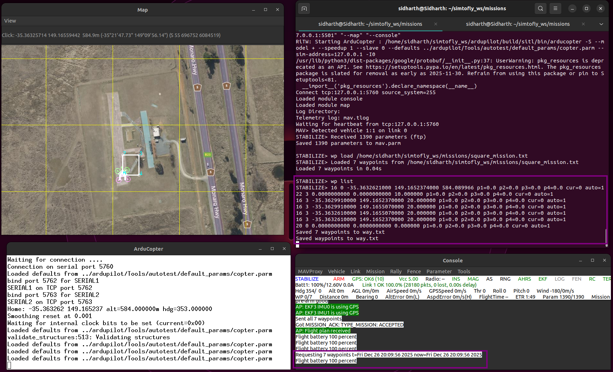

# 1.6 First Autonomous Mission

## What You'll Learn

Execute your first complete autonomous drone mission:

- Understand waypoint mission structure
- Create mission file in proper format
- Load mission into SITL
- Execute AUTO mode flight
- Monitor mission progress
- Analyze flight logs
- Complete Phase 1 successfully

**Time:** 60-90 minutes

---

## Prerequisites

Before starting, you must have completed:

- ✅ [1.1 Prerequisites and Setup](1.1-prerequisites.md)
- ✅ [1.2 Environment Setup](1.2-environment-setup.md)
- ✅ [1.3 ArduPilot SITL Installation](1.3-ardupilot-sitl.md)
- ✅ [1.4 MAVProxy Command Line](1.4-mavproxy-basics.md)
- ✅ [1.5 Gazebo Simulation](1.5-gazebo-simulation.md)
- ✅ Can fly drone in Gazebo successfully

---

## What is a Mission?

**Mission** = Pre-planned list of commands the drone executes autonomously

**Mission commands include:**

- Takeoff to altitude
- Fly to waypoint (latitude, longitude, altitude)
- Perform action (take photo, wait, change speed)
- Return to launch
- Land

**AUTO mode:** Flight mode that executes loaded mission automatically.

**Why missions matter:**

- Real-world applications (surveying, delivery, inspection)
- Repeatable flights
- Complex patterns without manual control
- Foundation for advanced autonomy

---

## Mission File Format

### QGroundControl Waypoint Format

ArduPilot uses **QGC WPL 110** format (QGroundControl Waypoint List).

**File structure:**
```
QGC WPL 110
0  1  0  16  0  0  0  0  LAT  LON  ALT  1
1  0  3  22  0.00  0.00  0.00  0.00  0.0  0.0  10.0  1
2  0  3  16  0.00  0.00  0.00  0.00  -35.36  149.16  20.0  1
3  0  3  16  0.00  0.00  0.00  0.00  -35.37  149.17  20.0  1
4  0  3  16  0.00  0.00  0.00  0.00  -35.36  149.17  20.0  1
5  0  3  21  0.00  0.00  0.00  0.00  0.0  0.0  0.0  1
```

**Header line:** `QGC WPL 110`

**Each line (waypoint) has 12 columns:**

| Column | Name | Description | Example |
|--------|------|-------------|---------|
| 1 | Index | Waypoint number | 0, 1, 2, 3... |
| 2 | Current | Home position (1) or waypoint (0) | 1 for home, 0 for others |
| 3 | Frame | Coordinate system (3 = relative altitude) | 3 |
| 4 | Command | MAVLink command ID | 16=WAYPOINT, 22=TAKEOFF, 21=RTL |
| 5-8 | Params | Command-specific parameters | Usually 0 |
| 9 | Latitude | Latitude in decimal degrees | -35.363261 |
| 10 | Longitude | Longitude in decimal degrees | 149.165237 |
| 11 | Altitude | Altitude in meters (relative to home) | 10.0, 20.0 |
| 12 | Autocontinue | Auto-continue to next waypoint (1=yes) | 1 |

---

### Common MAVLink Commands

| Command ID | Name | Purpose |
|------------|------|---------|
| 16 | NAV_WAYPOINT | Fly to waypoint and hold |
| 22 | NAV_TAKEOFF | Takeoff to altitude |
| 20 | NAV_LAND | Land at location |
| 21 | NAV_RETURN_TO_LAUNCH | Return and land at home |
| 93 | NAV_DELAY | Wait at waypoint (seconds) |

**Full list:** https://mavlink.io/en/messages/common.html

---

## Create Your First Mission

### Mission Plan

Let's create a simple square pattern:

1. **Takeoff** to 10m
2. **Fly North** 30m at 20m altitude
3. **Fly East** 30m at 20m altitude
4. **Fly South** 30m (back toward start) at 20m altitude
5. **Fly West** 30m (return to start position) at 20m altitude
6. **Return to Launch** (RTL at 15m, then land)

**Flight path:**

```
Start/Land
    ↓
    1 (Takeoff 10m)
    ↓
    2 (North 30m, alt 20m)
    ↓
    3 (East 30m, alt 20m)
    ↓
    4 (South 30m, alt 20m)
    ↓
    5 (West 30m, alt 20m)
    ↓
    6 (RTL - Return home)
```


---

### Create Mission File

The missions directory was created in Section 1.2. Create the mission file:

```bash
nano ~/simtofly_ws/missions/square_mission.txt
```


---

### Mission File Content

**Paste this exactly:**
```
QGC WPL 110
0	1	0	16	0	0	0	0	-35.363261	149.165237	584	1
1	0	3	22	0.00000000	0.00000000	0.00000000	0.00000000	0.00000000	0.00000000	10.0000000	1
2	0	3	16	0.00000000	0.00000000	0.00000000	0.00000000	-35.362991	149.165237	20.0000000	1
3	0	3	16	0.00000000	0.00000000	0.00000000	0.00000000	-35.362991	149.165507	20.0000000	1
4	0	3	16	0.00000000	0.00000000	0.00000000	0.00000000	-35.363261	149.165507	20.0000000	1
5	0	3	16	0.00000000	0.00000000	0.00000000	0.00000000	-35.363261	149.165237	20.0000000	1
6	0	3	21	0.00000000	0.00000000	0.00000000	0.00000000	0.00000000	0.00000000	0.0000000	1
```

**Save and exit:** Ctrl+X, then Y, then Enter

---

### Understanding the Mission File

**Line 0 (Home position):**
```
0  1  0  16  0  0  0  0  -35.363261  149.165237  584  1
```

- Index 0, Current=1 (home), Command 16 (waypoint)
- Lat/Lon: Default SITL location (Australia)
- Alt: 584m MSL (mean sea level)

**Line 1 (Takeoff):**
```
1  0  3  22  0  0  0  0  0  0  10.0  1
```

- Command 22 (TAKEOFF)
- Altitude: 10m (relative to home)

**Lines 2-5 (Waypoints):**
```
2  0  3  16  0  0  0  0  -35.362991  149.165237  20.0  1
```

- Command 16 (WAYPOINT)
- Each corner of square
- Altitude: 20m (relative)

**Line 6 (Return to Launch):**
```
6  0  3  21  0  0  0  0  0  0  0  1
```

- Command 21 (RTL)
- Climbs to 15m (default RTL altitude)
- Returns to home and lands

---

## Mission Execution Flow

Before executing, understand the state transitions:


---


## Execute Mission in SITL

### Video Demonstration

Watch the complete mission execution in SITL:

[](https://youtu.be/MSj1wQ13wiI)

*Complete autonomous square pattern mission with 2D map visualization*

---

### Launch SITL

**Start SITL with map and console:**

```bash
sim_vehicle.py -v ArduCopter --map --console
```

**Note:** We can run `sim_vehicle.py` from any directory because we added it to PATH in Section 1.3.

**Wait for:** `STABILIZE>` prompt and map window to open.

---

### Load Mission File

At MAVProxy prompt:

```bash
wp load /home/YOUR_USERNAME/simtofly_ws/missions/square_mission.txt
```

**Important:** Replace `YOUR_USERNAME` with your actual username.

>!!! warning "Full Absolute Path Required"
    MAVProxy does **not** expand `~` or `$HOME` variables. You must use the complete path.
 

**To find your username:**
```bash
echo $USER
```

**Expected output:**
```
Loaded 7 waypoints from /home/YOUR_USERNAME/simtofly_ws/missions/square_mission.txt
```


✅ **Success:** Mission loaded (7 items: home + 6 commands)

**Note:** MAVProxy requires full absolute path. Using `~` or `$HOME` will not work.

---

### Verify Mission Loaded

```bash
wp list
```

**Expected output:**
```
0  HOME(-35.363261, 149.165237, 584.00)
1  TAKEOFF(0.000000, 0.000000, 10.00)
2  WAYPOINT(-35.362991, 149.165237, 20.00)
3  WAYPOINT(-35.362991, 149.165507, 20.00)
4  WAYPOINT(-35.363261, 149.165507, 20.00)
5  WAYPOINT(-35.363261, 149.165237, 20.00)
6  RTL(0.000000, 0.000000, 0.00)
```



✅ **Success:** All waypoints listed correctly

**Map window:** Should show waypoint markers connected by lines.

---

### Execute Mission

**Command sequence:**

```bash
mode GUIDED
arm throttle
takeoff 10
mode AUTO
```

**What happens:**

1. Switch to GUIDED mode
2. Motors spin up (armed)
3. Drone takes off to 10m
4. Switch to AUTO mode
5. Mission executes automatically:
   - Climbs to 20m
   - Flies to each waypoint in sequence
   - Returns to start position (RTL)
   - Descends and lands
6. Automatically disarms

**This takes:** 2-3 minutes total.

**Why GUIDED first?** Starting in GUIDED mode and taking off manually before AUTO ensures all systems are working and provides smoother transition to autonomous flight.

---

### Monitor Mission Progress

**Watch console window:**
- Current waypoint number
- Altitude climbing/descending
- Distance to next waypoint

**Watch map window:**
- Drone icon moving
- Following waypoint path
- Position updating in real-time

**MAVProxy prompt shows:**
```
AUTO> WP: 2
AUTO> WP: 3
AUTO> WP: 4
...
```

✅ **Success:** Mission completes, drone lands and disarms

---

## Execute Mission in Gazebo

### Video Demonstration

Watch the mission with realistic 3D visualization:

[](https://youtu.be/ijJwYAE4JKQ)

*Same mission with Gazebo Harmonic 3D physics and visualization*

---

### Launch Gazebo

**Terminal 1:**
```bash
gz sim -v4 -r iris_runway.sdf
```

**Wait for:** Gazebo window and drone to load.

---

### Launch SITL

**Terminal 2:**
```bash
sim_vehicle.py -v ArduCopter -f gazebo-iris --model JSON --map --console
```

**Wait for:** Connection established, `STABILIZE>` prompt.

---

### Load and Execute Mission

**In Terminal 2 (SITL prompt):**

```bash
wp load /home/YOUR_USERNAME/simtofly_ws/missions/square_mission.txt
wp list
mode GUIDED
arm throttle
takeoff 10
mode AUTO
```

**Watch in Gazebo:**

- Propellers spin
- Drone lifts off
- Flies square pattern in 3D
- Returns and lands
- Realistic physics simulation

**Much more impressive with 3D visualization!**

✅ **Success:** Complete autonomous mission in Gazebo

---

## Understanding Mission Behavior

### Mission States

**Pre-flight:**

- Mission loaded but not executing
- Can review with `wp list`
- Can clear with `wp clear`

**During mission (AUTO mode):**

- Executing waypoints sequentially
- Current waypoint shown in console
- Can pause: `mode LOITER` (requires `rc 3 1500` first)
- Can resume: `mode AUTO` (continues from next waypoint)

**Mission complete:**

- Returns to launch via RTL
- Lands at home position
- Automatically disarms
- Mode stays AUTO

---

### RTL Behavior

**When RTL command executes (waypoint 6 or manual `mode RTL`):**

1. Drone climbs to RTL altitude (15m default) if below
2. Flies directly to home position
3. Descends at controlled rate
4. Lands at home
5. Automatically disarms

**RTL altitude parameter:** `RTL_ALT` (default 1500 = 15 meters)

**Useful for:** Mission completion or emergency return

---

### Pausing Mission Mid-Flight

**To pause and hold position:**

```bash
rc 3 1500        # Set throttle first (prevents altitude loss)
mode LOITER      # Holds current GPS position
```

**To resume mission:**
```bash
mode AUTO        # Continues from next waypoint
```

**Emergency abort:**
```bash
mode RTL         # Returns to home immediately
```

---

## Alternative Mission Execution Method

### Advanced: Direct AUTO Mode

**For experienced users, direct AUTO mode from ground:**

```bash
wp load /home/YOUR_USERNAME/simtofly_ws/missions/square_mission.txt
mode LOITER
rc 3 1500
arm throttle
mode AUTO
```

**This method:**

- Uses mission's TAKEOFF command directly
- Requires throttle setting to prevent failsafe
- More complex but demonstrates proper AUTO mode usage

**Beginners should use GUIDED method shown above.**

---

## Create Custom Mission

### Using Your Location

**Find your coordinates:**

- Google Maps: Right-click location → Click coordinates to copy
- Format: Latitude, Longitude (e.g., 37.7749, -122.4194)

---

### Mission Template

Create `~/simtofly_ws/missions/custom_mission.txt`:

```
QGC WPL 110
0	1	0	16	0	0	0	0	YOUR_LAT	YOUR_LON	YOUR_ALT	1
1	0	3	22	0	0	0	0	0	0	10.0	1
2	0	3	16	0	0	0	0	WAYPOINT1_LAT	WAYPOINT1_LON	15.0	1
3	0	3	16	0	0	0	0	WAYPOINT2_LAT	WAYPOINT2_LON	15.0	1
4	0	3	21	0	0	0	0	0	0	0	1
```

**Replace:**

- `YOUR_LAT`, `YOUR_LON` — Your home position
- `YOUR_ALT` — Your altitude MSL (check Google Earth)
- `WAYPOINT1_LAT`, `WAYPOINT1_LON` — First waypoint
- `WAYPOINT2_LAT`, `WAYPOINT2_LON` — Second waypoint

---

### Coordinate Math (Approximate)

**At equator (rough estimates):**

- 1° latitude ≈ 111 km
- 1° longitude ≈ 111 km

**For small distances:**

- 0.0001° ≈ 11 meters
- 0.001° ≈ 111 meters

**Example: Move 50m North from start:**
```
Original Lat: -35.363261
Add 0.00045: -35.362811  (≈50m North)
```

>**Better tool:** Use mission planner software or online calculators.

---

## Analyzing Flight Logs

### Where Logs Are Saved

SITL saves logs automatically:

```bash
cd ~/simtofly_ws/ardupilot/ArduCopter/logs
ls -lt
```

**Expected output:**
```
00000001.BIN
00000002.BIN
...
```

**Latest log:** Highest number.

---

### Advanced: Log Analysis (Optional)

**Online tool (Recommended for beginners):**

Upload logs to: **https://plot.ardupilot.org/**

**Features:**

- No installation needed
- Visual graphs of flight data
- Analyze altitude, speed, position
- Compare multiple flights
- Share analysis with others

**To upload:**

1. Find latest `.BIN` file in logs directory
2. Go to https://plot.ardupilot.org/
3. Upload the file
4. Explore interactive graphs

---

### Command-Line Log Viewing

**View log summary:**
```bash
cd ~/simtofly_ws/ardupilot/ArduCopter/logs
mavlogdump.py 00000001.BIN | less
```

**Extract mission data:**
```bash
mavlogdump.py 00000001.BIN | grep "MISSION"
```

**Extract mode changes:**
```bash
mavlogdump.py 00000001.BIN | grep "MODE"
```

**Extract GPS positions:**
```bash
mavlogdump.py 00000001.BIN | grep "GPS"
```

---

## Mission Best Practices

### Safety Guidelines

**Always:**

- Test missions in SITL before real hardware
- Include takeoff command as first action
- Include RTL or LAND as last command
- Keep waypoints within safe distance
- Check altitude limits (not too high)

**Never:**

- Skip home position (line 0)
- Use absolute altitude without understanding MSL
- Create waypoints too close together (minimum ~5m)
- Forget autocontinue flag (missions won't progress)

---

### Mission Design Tips

**Start simple:**

- 3-5 waypoints maximum
- Single altitude throughout
- Familiar area

**Progress to complex:**

- Multiple altitudes
- Actions at waypoints (delay, change speed)
- Survey patterns (grid, spiral)

**Test incrementally:**

- Fly each waypoint manually first
- Then convert to mission
- Test in SITL
- Finally test on real hardware (Phase 4)

---

## Verification Checklist

Before moving to Phase 2, verify you can:

- [ ] Launch SITL from any directory (PATH set)
- [ ] Create mission file with correct format
- [ ] Load mission using full path
- [ ] Verify mission with `wp list`
- [ ] Execute mission in SITL (GUIDED → AUTO)
- [ ] Execute mission in Gazebo with 3D visualization
- [ ] Monitor mission progress via map and console
- [ ] Understand RTL behavior
- [ ] Pause and resume mission if needed
- [ ] Find and view flight logs
- [ ] Create custom mission files

**All checked?** Congratulations! Phase 1 complete! 

---

## What You Accomplished in Phase 1

**Simulation Environment:**

- ✅ Set up complete Ubuntu development environment
- ✅ Installed ArduPilot SITL simulator
- ✅ Configured Gazebo Harmonic 3D simulation
- ✅ Built ArduPilot Gazebo plugin from source

**Drone Control:**

- ✅ Mastered MAVProxy command-line control
- ✅ Understood flight modes and their purposes
- ✅ Performed manual flights (arm, takeoff, navigate, land)
- ✅ Monitored telemetry data in real-time

**Autonomous Flight:**

- ✅ Created waypoint mission files
- ✅ Loaded and executed autonomous missions
- ✅ Completed full square pattern mission in SITL and Gazebo
- ✅ Analyzed flight logs

**Foundation Built:**

- ✅ Safe testing environment (no hardware risk)
- ✅ Understanding of ArduPilot fundamentals
- ✅ Ready for ROS2 integration (Phase 2)

---

## What's Next: Phase 2 - ROS2 Integration

**Coming in Phase 2:**

- Install ROS2 Humble
- Setup MAVROS (MAVLink ↔ ROS2 bridge)
- Create ROS2 nodes for drone control
- Subscribe to telemetry topics
- Publish control commands
- Execute missions via ROS2
- Visualize data in RViz

**Why ROS2?**

- More flexible than MAVProxy
- Industry-standard robotics framework
- Integrate sensors (cameras, lidar)
- Advanced autonomy algorithms
- Multi-robot systems

---

## Common Questions

### Q: Can I create missions with a GUI instead of text files?

**A:** Yes! Use these tools:

- **Mission Planner** (Windows, most popular)
- **QGroundControl** (Cross-platform)
- **APM Planner 2** (Cross-platform)

They all export to same .txt format we use here.

---

### Q: What's the maximum mission size?

**A:** ArduPilot supports up to 700+ waypoints, but practical limits:

- SITL: Unlimited (memory constrained)
- Real hardware: ~100-200 waypoints typical
- Depends on flight controller memory

---

### Q: Why use GUIDED takeoff before AUTO mode?

**A:** Starting in GUIDED mode provides:

- Visual confirmation systems are working
- Smoother transition to AUTO mode
- Better for beginners learning the workflow
- Advanced users can use direct AUTO mode

---

### Q: Why does my mission skip waypoints?

**Possible causes:**

1. Autocontinue flag = 0 (should be 1)
2. Waypoint acceptance radius too large
3. Mission file syntax error

**Check:** `wp list` shows all waypoints correctly.

---

### Q: How do I add camera trigger at waypoint?

**A:** Use DO_SET_CAM_TRIGG_DIST command (ID 206):
```
3  0  3  206  10  0  0  0  0  0  0  1
```
Triggers camera every 10 meters.

**More on this:** ArduPilot camera trigger documentation.

---

### Q: What's the difference between LAND and RTL?

**A:**

- **LAND (20):** Lands at current position immediately
- **RTL (21):** Returns to home position, then lands
- **RTL climbs to 15m** before returning (safety feature)

---

## Troubleshooting

### Mission won't load - "Failed to load waypoints"

**Cause:** File format error or path issue

**Solution:**

1. Use full absolute path (not `~` or `$HOME`)
2. Check header line: `QGC WPL 110` (exact text)
3. Verify 12 columns per line (tab or space separated)
4. No extra blank lines
5. Home position (line 0) has Current=1

---

### Mission loads but drone doesn't move

**Cause:** Not in AUTO mode or not armed properly

**Solution:**
```bash
mode GUIDED
arm throttle
takeoff 10
mode AUTO
```
In this exact order.

---

### Drone flies to wrong location

**Cause:** Incorrect coordinates in mission file

**Solution:**

- Verify latitude/longitude are in decimal degrees (not DMS)
- Check sign (negative for South/West)
- Verify altitude is relative (Frame=3), not absolute

---

### Mission starts but immediately disarms

**Cause:** Throttle failsafe or starting directly in AUTO

**Solution:** Use GUIDED takeoff method:
```bash
mode GUIDED
arm throttle
takeoff 10
mode AUTO
```

---

### Drone hovers at waypoint and doesn't continue

**Cause:** Autocontinue flag = 0

**Solution:**
- Last column of each line should be `1`
- Change `0` to `1` in mission file
- Reload mission

---

### "No GPS lock" in SITL

**Cause:** Rare in SITL, GPS initializes instantly

**Solution:**

- Wait 5 seconds after SITL launch
- Check console shows GPS: 3D Fix
- Restart SITL if issue persists

---

### Cannot load mission file - "No such file or directory"

**Cause:** MAVProxy doesn't expand `~` or `$HOME`

**Solution:** Use full absolute path:
```bash
wp load /home/YOUR_USERNAME/simtofly_ws/missions/square_mission.txt
```

Find your username with: `echo $USER`

---

## Additional Resources

**ArduPilot Documentation:**

- Mission Commands: https://ardupilot.org/copter/docs/common-mavlink-mission-command-messages-mav_cmd.html
- Mission Planning: https://ardupilot.org/copter/docs/common-mission-planning.html
- AUTO Mode: https://ardupilot.org/copter/docs/auto-mode.html

**MAVLink Protocol:**

- Command Reference: https://mavlink.io/en/messages/common.html
- Mission Protocol: https://mavlink.io/en/services/mission.html

**Tools:**

- QGroundControl: http://qgroundcontrol.com/
- Mission Planner: https://ardupilot.org/planner/
- MAVProxy Documentation: https://ardupilot.org/mavproxy/
- Log Analysis: https://plot.ardupilot.org/

---

## Congratulations on Completing Phase 1!

You've built a solid foundation in drone simulation and autonomous flight. You now understand:

- ArduPilot SITL simulator
- Gazebo 3D visualization
- MAVProxy control
- Waypoint missions
- Autonomous flight execution

**You're ready for Phase 2: ROS2 Integration**

Take a break, review what you've learned, and when ready, continue your journey!

---

## Share Your Success

**Completed Phase 1?** We'd love to hear about it!

- Star the repository: https://github.com/simtofly/simtofly-guide
- Share your experience in Discussions
- Help others in Issues section
- Tweet with #SimToFly

**Your feedback helps improve this tutorial for everyone!**

---

[← Back: 1.5 Gazebo Simulation](1.5-gazebo-simulation.md) | [Next: Phase 2 Overview →](../phase-2-ros2/README.md)

---

<p align="center">
  <b> Phase 1 Complete! </b><br>
  <i>You've mastered simulation. Now let's integrate ROS2.</i><br><br>
  <a href="../phase-2-ros2/README.md">Continue to Phase 2 →</a>
</p>